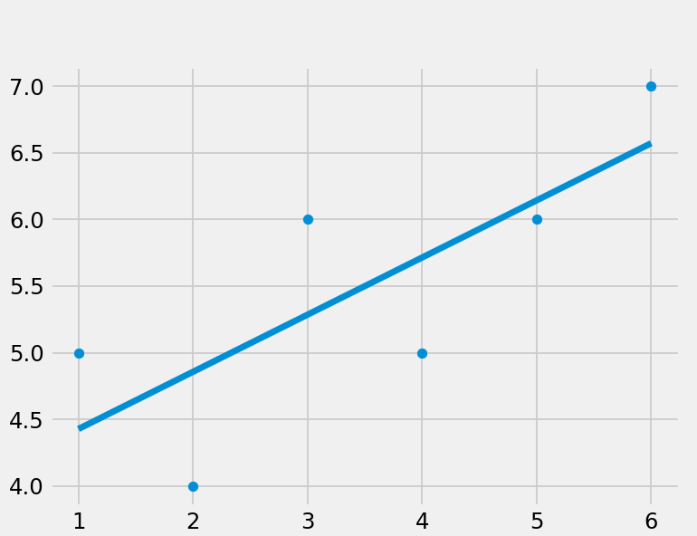

# Linear Regression and SVM Classification

## Overview

This repository contains the implementation of linear regression and support vector machine (SVM) classification for stock price prediction using the Quandl dataset. The project achieves an accuracy of 98% with the linear regression model implemented using the sklearn library and up to 97% accuracy with various SVM kernels.

## Contents

- `linear_regression.py`: Python file containing the implementation of linear regression using the sklearn library on the Quandl dataset for stock price prediction.
  
- `lin_reg_svm.py`: Python file demonstrating the implementation of SVM classification with different kernels (linear, radial basis function, etc.) for stock price prediction.

- `custom_linear_regression.py`: A custom implementation of linear regression for classifying demo numbers.

## Dataset

The dataset used in this project is sourced from Quandl and is focused on stock prices. The accuracy achieved with linear regression and SVM models is a testament to the effectiveness of these techniques in predicting stock price movements.

## Instructions

1. **Install Dependencies**: Make sure to install the required dependencies by running:
    ```bash
    pip install -r requirements.txt
    ```

2. **Run Notebooks**: Execute the Jupyter Notebooks (`linear_regression_sklearn.ipynb` and `svm_classification.ipynb`) to see the step-by-step implementation and results.

3. **Custom Linear Regression**: Explore the custom linear regression implementation in `custom_linear_regression.py` for classifying demo numbers.

## Results

- Linear Regression (sklearn): 98% accuracy
- SVM Classification: Up to 97% accuracy with different kernels
  
  

## Contributing

Feel free to contribute by opening issues, providing feedback, or submitting pull requests. Your input is valuable!

## License

This project is licensed under the MIT License - see the [LICENSE](LICENSE) file for details.
